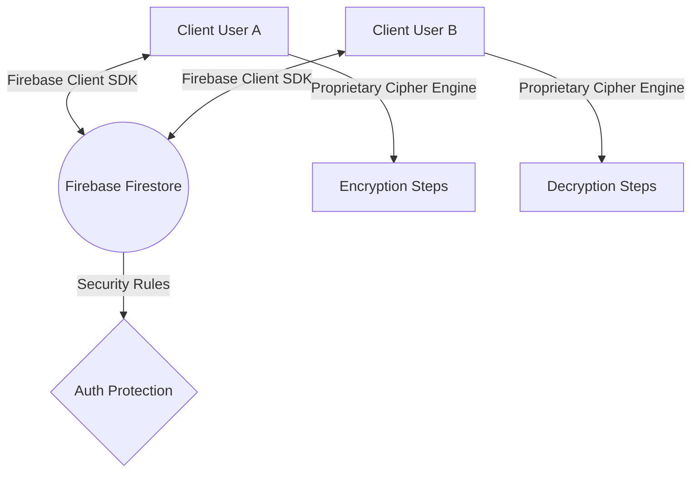

# SeCom // Technical Architecture & Overview

Welcome to **SeCom** (Secure Communication Portal). SeCom is a real-time, peer-to-peer encrypted chat web application styled with a vibrant, Gen-Z Neo-brutalist "hand-drawn sketchbook" aesthetic. It integrates a proprietary multi-layered encryption engine with real-time database synchronization.

---

## 1. Technology Stack

The application is built on a modern, ultra-lightweight client-side stack:

| Layer | Technology | Details |
| :--- | :--- | :--- |
| **Development & Build** | Vite v5.4.21 | Hot Module Replacement (HMR) for instant rendering; fast bundling for production. |
| **Core Frontend** | Vanilla HTML5 & Javascript (ES Modules) | High-performance, native logic execution. |
| **Styling & Theme** | Custom CSS3 | Custom wobbly variables, neo-brutalist drop-shadow offsets, and responsive media queries. |
| **Icons & Typography** | FontAwesome & Google Fonts | Cursive and handwriting fonts (`Patrick Hand`, `Architects Daughter`) and monospaced code (`Fira Code`). |
| **Backend & Sync** | Google Firebase (v10.8.0) | Firestore (real-time NoSQL database) and Firebase Anonymous Authentication. |

---

## 2. System Architecture

SeCom operates as a fully client-side, serverless web application. 

### Flow of Operations:
1. **Authentication**: Users enter a username, and the client establishes an anonymous authentication session (`signInAnonymously`) with Firebase Auth.
2. **Room Management**:
   - **Create**: Generating a new channel creates a document in Firestore under `rooms/{roomId}` with an active keyspace configuration.
   - **Join**: Entering a 6-digit code queries the room metadata document. If it exists, the client connects to the channel stream.
3. **Real-time Sync**: The client initiates an `onSnapshot` listener on the subcollection `rooms/{roomId}/messages`. When a new message is added by either client, it is pushed to all connected users in real time.

---

## 3. Cryptographic Pipeline (The Cipher Engine)

The core feature of SeCom is its secure, proprietary, multi-layered cryptographic pipeline. It processes data using a multi-stage encryption engine that combines dynamic key derivation with layered encoding layers.

- **Dynamic Session-Key Handshake:** When users connect, a secure peer-to-peer key exchange is executed in the browser memory. The derived key exists only in the browser RAM and is never transmitted over the network or saved in database records.
- **Layered Encryption Pipeline:** The message payload undergoes a multi-stage transformation pipeline combining non-linear substitutions, modular arithmetic matrix mapping, and dynamic symbol encoding before transmission.
- **Symmetric Block Transport:** The network payload uses authenticated symmetric block ciphers with unique initialization vectors to prevent replay attacks and eavesdropping.

---

## 4. Ephemeral Decryption & Self-Destruct Mechanics

To ensure maximum message security, SeCom implements an ephemeral single-read self-destruct policy:

1. **Decryption Initiation**:
   - When a recipient clicks **`DECRYPT`** (or is in Auto Decrypt mode), the client triggers an update to the Firestore message document, setting `decryptedAt: Date.now()`.
2. **Dynamic 15-Second Countdown**:
   - The recipient's application calculates the elapsed time since decryption started.
   - The message is decrypted and shown in plain text alongside a ticking timer: `Locks in X seconds...`.
   - Once the counter hits zero, the plaintext is removed from the DOM, and the message state is replaced with `PERMANENTLY LOCKED (EXPIRED)`.
3. **Manual Lock Button:**
   - Recipients can click the **LOCK NOW** button to immediately delete the message document from the database, permanently locking it.
4. **Database Consistency & Anti-Cheat**:
   - Since the timestamp is stored directly in the Firestore database document, refreshing the page or leaving the room does not reset the countdown. Once a message has been decrypted for 15 cumulative seconds, it is locked forever for all clients.
   - The sender is restricted from ever decrypting outgoing messages; their view of sent encrypted blocks remains locked.

---

## 5. UI/UX Design System (Vibrant Gen-Z Sketchbook)

The visual design system of SeCom breaks away from standard layouts to present a hand-drawn sketchbook aesthetic:

* **Grid/Graph Paper Background**: A custom repeating linear CSS gradient forms green graph lines mimicking mathematical paper sheets.
* **Hand-Drawn Wobble**: Utilizes custom wobbly border radii to make boxes look slightly uneven.
* **Neo-Brutalist Drop Shadows**: High-contrast, bold outlines (`border: 3px solid #000;`) coupled with offset black shadows (`box-shadow: 6px 6px 0px #000000;`).
* **Sketchbook Details**: Paperclips (FontAwesome rotated overlays), coffee ring stains, translucent neon duct tape, scribbled classified stickers, and a dedicated **`EPHEMERAL POLICY`** warning banner in the metadata panel.
* **Highlighter Accent Palette**:
  - Main background: Pastel mint paper (`#eaf5ed`)
  - Primary yellow: Highlighter yellow (`#facc15`)
  - Accent green: Neon marker green (`#4ade80`)
  - Warning orange: Duct tape orange (`#fb923c`)
  - Accompanying sticky note headers: Light purple (`#faf5ff`) and sticky note yellow (`#fefce8`).
