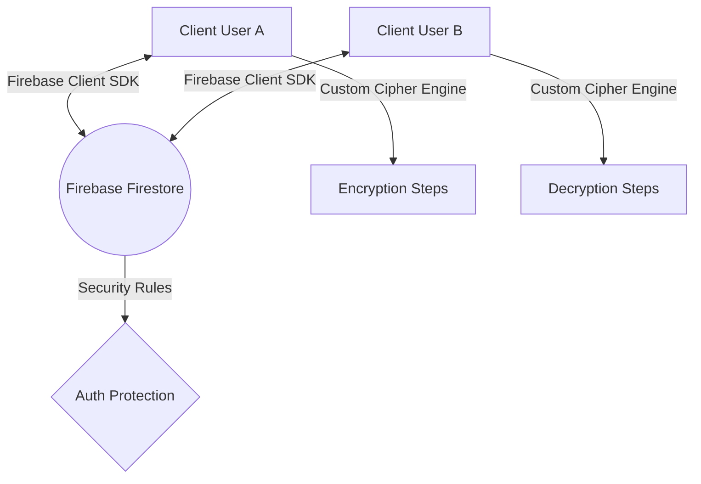

# SeCom // Technical Architecture & Documentation

Welcome to the official technical documentation for **SeCom** (Secure Communication Portal). SeCom is a real-time, peer-to-peer encrypted chat web application styled with a vibrant, Gen-Z Neo-brutalist "hand-drawn sketchbook" aesthetic. It integrates a custom 5-layered symmetric block cipher with real-time data sync using Google Firebase.

---

## 1. Technology Stack

The application is built on a modern, ultra-lightweight client-side stack:

| Layer | Technology | Details |
| :--- | :--- | :--- |
| **Development & Build** | Vite v5.4.21 | Hot Module Replacement (HMR) for instant rendering; fast bundling for production. |
| **Core Frontend** | Vanilla HTML5 & Javascript (ES Modules) | High-performance, native logic execution. |
| **Styling & Theme** | Custom CSS3 | Custom wobbly variables, neo-brutalist drop-shadow offsets, and responsive media queries. |
| **Icons & Typography** | FontAwesome & Google Fonts | Cursive and handwriting fonts (`Patrick Hand`, `Architects Daughter`) and monospaced code (`Fira Code`). |
| **Backend & Sync** | Google Firebase (v10.8.0) | Firestore (real-time NoSQL database) and Firebase Anonymous Authentication. |

---

## 2. System Architecture

SeCom operates as a fully client-side, serverless web application. 



### Flow of Operations:
1. **Authentication**: Users enter a username, and the client establishes an anonymous authentication session (`signInAnonymously`) with Firebase Auth.
2. **Room Management**:
   - **Create**: Generating a new channel creates a document in Firestore under `rooms/{roomId}` with an active cryptographic matrix seed `[3, 4, 2, 3]`.
   - **Join**: Entering a 6-digit code queries the room metadata document. If it exists, the client connects to the channel stream.
3. **Real-time Sync**: The client initiates an `onSnapshot` listener on the subcollection `rooms/{roomId}/messages`. When a new message is added by either client, it is pushed to all connected users in real time.

---

## 3. Cryptographic Pipeline (The Cipher Engine)

The core feature of SeCom is its secure, custom, multi-layered symmetric cryptographic pipeline. It processes data using a **Mod-27 Hill Cipher block size 2** algorithm, surrounded by pre-processing and post-processing layers:

```
[Plaintext String]
      │
      ▼
Layer 1: Atbash Substitution (A -> Z, B -> Y, etc.)
      │
      ▼
Layer 2: Mod-27 Character-to-Number Map (a-z -> 1-26, Space -> 0)
      │
      ▼
Layer 3: Mod-27 Hill Cipher (2x2 Matrix Block Multiplication)
      │
      ▼
Layer 4: Morse Code Translator (Numbers to Morse dots/dashes)
      │
      ▼
Layer 5: 2-bit Binary Encoding (Morse -> 00, 01, 10, 11)
      │
      ▼
[Binary Ciphertext Transport Payload]
```

### Step-by-Step Mathematical Explanation:

#### Layer 1: Atbash Substitution
The input plaintext is converted to lowercase and filtered to alphanumeric characters and spaces. An Atbash substitution is performed, mirroring letters across the alphabet ($a \leftrightarrow z$, $b \leftrightarrow y$):
$$\text{Atbash}(x) = 25 - x \pmod{26}$$

#### Layer 2: Mod-27 Character Mapping
Characters are mapped to numbers from $0$ to $26$ using a mod-27 space-included alphabet:
- ` ` (space) $\rightarrow 0$
- `a` $\rightarrow 1$, `b` $\rightarrow 2$, ..., `z` $\rightarrow 26$

#### Layer 3: Mod-27 Hill Cipher (Matrix Block Multiplication)
The mapped numbers are grouped into blocks of 2 ($X = [x_1, x_2]^T$). If the message length is odd, it is padded with a trailing space ($0$).
Each block is multiplied by the shared $2 \times 2$ encryption matrix $K$:
$$K = \begin{pmatrix} 3 & 4 \\ 2 & 3 \end{pmatrix}$$

The encrypted output block $Y = [y_1, y_2]^T$ is computed modulo 27:
$$Y = K \cdot X \pmod{27}$$
$$\begin{pmatrix} y_1 \\ y_2 \end{pmatrix} = \begin{pmatrix} 3x_1 + 4x_2 \\ 2x_1 + 3x_2 \end{pmatrix} \pmod{27}$$

To decrypt, the receiver multiplies the block $Y$ by the modular inverse matrix $K^{-1}$ modulo 27:
- The determinant is $\det(K) = (3 \times 3) - (4 \times 2) = 9 - 8 = 1$.
- Since $\det(K) \equiv 1 \pmod{27}$, the modular multiplicative inverse is $1^{-1} \equiv 1 \pmod{27}$.
- The inverse matrix $K^{-1}$ is calculated as:
$$K^{-1} = 1 \cdot \begin{pmatrix} 3 & -4 \\ -2 & 3 \end{pmatrix} \equiv \begin{pmatrix} 3 & 23 \\ 25 & 3 \end{pmatrix} \pmod{27}$$

$$X = K^{-1} \cdot Y \pmod{27}$$
$$\begin{pmatrix} x_1 \\ x_2 \end{pmatrix} = \begin{pmatrix} 3y_1 + 23y_2 \\ 25y_1 + 3y_2 \end{pmatrix} \pmod{27}$$

#### Layer 4: Morse Code Translation
The output numbers of the Hill Cipher block are translated back to alphabetical characters (`0` $\rightarrow$ space, `1` $\rightarrow$ `a` etc.). These characters are then converted to Morse Code:
- Dot (`.`), Dash (`-`), Character space (` `), and Word space (`/`).

#### Layer 5: 2-bit Binary Encoding
To compress and format the Morse symbols into a computer-readable payload, each Morse character is encoded into a 2-bit binary representation:
- `.` (dot) $\rightarrow$ `00`
- `-` (dash) $\rightarrow$ `01`
- ` ` (character space) $\rightarrow$ `10`
- `/` (word space) $\rightarrow$ `11`

The resulting stream of ones and zeros is sent over the network as the encrypted message payload.

---

## 4. Ephemeral Decryption & Self-Destruct Mechanics

To ensure maximum message security, SeCom implements an ephemeral single-read self-destruct policy:

1. **Decryption Initiation**:
   - When a recipient clicks **`DECRYPT`** (or is in Auto Decrypt mode), the client triggers an update to the Firestore message document, setting `decryptedAt: Date.now()`.
2. **Dynamic 30-Second Countdown**:
   - The recipient's application calculates the elapsed time since decryption started: `elapsed = (Date.now() - decryptedAt) / 1000`.
   - If `elapsed < 30`, the message is decrypted and shown in plain text alongside a ticking timer: `Locks in X seconds...`.
   - If `elapsed >= 30` (or when the counter hits zero), the plaintext is removed from the DOM, and the message state is replaced with `PERMANENTLY LOCKED (EXPIRED)`.
3. **Database Consistency & Anti-Cheat**:
   - Since the timestamp is stored directly in the Firestore database document, refreshing the page or leaving the room does not reset the countdown. Once a message has been decrypted for 30 cumulative seconds, it is locked forever for all clients.
   - The sender is restricted from ever decrypting outgoing messages; their view of sent encrypted blocks remains locked as binary streams with a `TRANSMITTED SECURELY` status badge.

---

## 5. UI/UX Design System (Vibrant Gen-Z Sketchbook)

The visual design system of SeCom breaks away from standard layouts to present a hand-drawn sketchbook aesthetic:

* **Grid/Graph Paper Background**: A custom repeating linear CSS gradient forms green graph lines mimicking mathematical paper sheets.
* **Hand-Drawn Wobble**: Utilizes custom wobbly border radii to make boxes look slightly uneven:
  ```css
  --wobbly-radius: 255px 15px 225px 15px/15px 225px 15px 255px;
  ```
* **Neo-Brutalist Drop Shadows**: High-contrast, bold outlines (`border: 3px solid #000;`) coupled with offset black shadows (`box-shadow: 6px 6px 0px #000000;`).
* **Sketchbook Details**: Paperclips (FontAwesome rotated overlays), coffee ring stains, translucent neon duct tape, scribbled classified stickers, and a dedicated **`EPHEMERAL POLICY`** warning banner in the metadata panel.
* **Highlighter Accent Palette**:
  - Main background: Pastel mint paper (`#eaf5ed`)
  - Primary yellow: Highlighter yellow (`#facc15`)
  - Accent green: Neon marker green (`#4ade80`)
  - Warning orange: Duct tape orange (`#fb923c`)
  - Accompanying sticky note headers: Light purple (`#faf5ff`) and sticky note yellow (`#fefce8`).

---

## 6. File Structure Guide

The application codebase is organized cleanly within the main workspace:

```
SeCom/
│
├── index.html            # Main HTML layout, containing login, lobby, and chat viewport.
├── style.css             # Complete stylesheet defining theme, layout, and responsiveness.
├── cipher.js             # Cryptographic engine module (all Atbash/Hill/Morse/Binary functions).
├── app.js                # State controller, Firebase integration, DOM bindings, and event handlers.
├── firebase-config.js    # Google Firebase client initialization config.
├── firestore.rules       # Security rules restricting database operations.
└── package.json          # Node scripts and Vite development environment setup.
```
